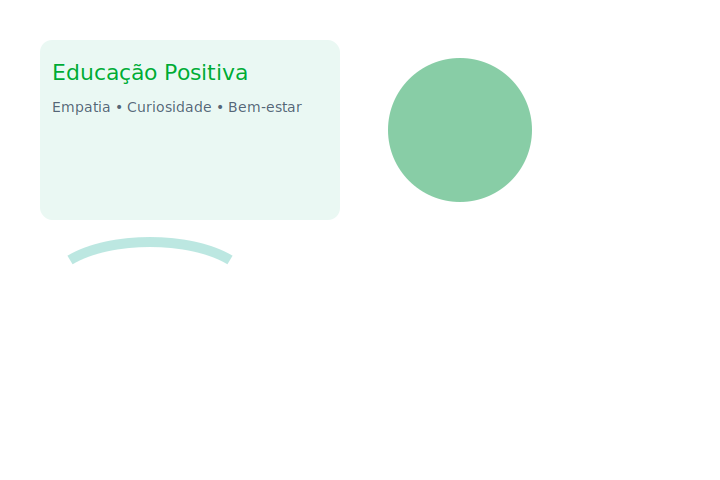

#  Educação Positiva — SPA Responsivo

Um **Single Page Application (SPA)** desenvolvido com **HTML, CSS e JavaScript puro**, com design leve, natural e totalmente responsivo.  
Tema: **Educação Positiva** — promovendo empatia, curiosidade e bem-estar no aprendizado.

---

##  Acesse o site
 [https://85jotavitor.github.io/educacao-positiva/](https://85jotavitor.github.io/educacao-positiva/)

---

##  Funcionalidades
- Navegação **SPA** (sem recarregar páginas)
- **Três seções** principais:  
  -  Início  
  -  Projetos  
  -  Cadastro (com validação)
- **Validação de formulário** completa (nome, e-mail, CPF, telefone)
- Menu **responsivo** com:
  -  Hambúrguer no mobile  
  -  Dropdown no desktop
- **Design leve e natural**, em tons pastel e transições suaves
- **Armazenamento local (localStorage)** para simular envio de cadastros

---
---

##  Prévia do layout

---

##  Tecnologias utilizadas
- HTML5  
- CSS3  
- JavaScript (ES6)  
- GitHub Pages (para hospedagem gratuita)

---

##  Sobre o tema
A **Educação Positiva** busca unir conhecimento e bem-estar, incentivando a empatia, a curiosidade e o respeito no processo de ensino-aprendizagem.  
Este projeto demonstra como o design e a tecnologia podem refletir esses valores.

---

##  Autor
Desenvolvido por **João Vitor da Silva Alves**  
 *[adicione seu e-mail se quiser]*  
 [https://github.com/85jotavitor](https://github.com/85jotavitor)

---

## 🧩 Estrutura do projeto
